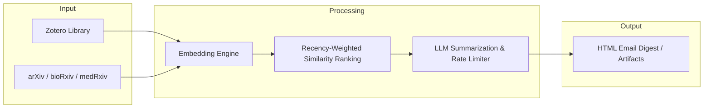

# Zotero-arXiv-Daily

[](https://github.com/andreassag/zotero-arxiv-daily/actions/workflows/ci.yml)
[](https://github.com/andreassag/zotero-arxiv-daily/actions/workflows/gitleaks.yml)
[](https://go.dev/)
[](LICENSE)

**Zotero-arXiv-Daily** is an automated, high-performance Go application that delivers personalized daily research digests directly to your inbox. It synchronizes with your personal Zotero reference library, monitors preprint repositories, and uses semantic vector embeddings and LLMs to surface, rank, and summarize the papers most relevant to your research.

---

## Features

- **Multi-Source Preprint Ingestion**: Monitors daily releases from **arXiv** (with category cross-listing support), **bioRxiv**, and **medRxiv**.
- **Semantic Relevance Ranking**: Computes vector cosine similarity between newly published abstracts and your Zotero corpus (via Gemini or OpenAI-compatible embedding models), weighted by the recency of addition to your library.
- **AI-Powered TL;DR Summaries**: Generates high-yield, structured paper summaries with LLMs (Google Gemini, OpenAI GPT-4o, DeepSeek, etc.).
- **Built-in Rate Limiting**: Token-bucket rate limiters enforce requests-per-minute (RPM), tokens-per-minute (TPM), and requests-per-day (RPD) to eliminate API throttling and prevent account lockouts.
- **Rich HTML Email Digest**: Formats abstracts with full Markdown rendering (proper formatting of italics, bolding, math symbols, and code), author affiliations (resolved via OpenAlex and bioRxiv APIs), direct PDF links, and linked code implementations.
- **Fast, Native Go Engine**: Statically compiled binary with minimal memory footprint and zero external runtime dependencies.
- **Automated CI/CD & Security**: Includes `govulncheck` vulnerability scanning, `gitleaks` secret detection, `golangci-lint` verification, and multi-platform packaging via `goreleaser`.

---

## Architecture



1. **Sync**: Queries your Zotero library collections (with optional include/exclude glob path filtering) and fetches preprints released in the target window.
2. **Embed & Score**: Generates semantic embeddings for paper abstracts and calculates recency-decay weighted similarity scores against your Zotero items.
3. **Summarize**: Prompts an LLM under strict rate limits to generate concise TL;DR takeaways for the top candidate papers.
4. **Deliver**: Builds a responsive HTML digest complete with resolved author affiliations and sends it via SMTP, or saves it locally when run in test mode.

---

## Quick Start (GitHub Actions)

Deploy the digest as a scheduled GitHub Actions workflow with zero dedicated infrastructure.

### 1. Configure Repository Secrets

Add the following credentials under **Settings > Secrets and variables > Actions > Secrets**:

| Secret | Description | Example |
| :--- | :--- | :--- |
| `ZOTERO_ID` | Numeric Zotero User ID ([Zotero API Settings](https://www.zotero.org/settings/keys)) | `12345678` |
| `ZOTERO_KEY` | Zotero API key with read permissions | `AB5tZ877...` |
| `SMTP_SERVER` | SMTP host of your email provider | `smtp.gmail.com` |
| `SMTP_PORT` | SMTP port (`587` for STARTTLS or `465` for SSL) | `587` |
| `SMTP_USERNAME` | SMTP authentication username / account email | `user@example.com` |
| `SMTP_PASSWORD` | SMTP password or app-specific password | `xxxx-xxxx-xxxx` |
| `SMTP_SENDER` | Sender email address | `digest@example.com` |
| `SMTP_RECEIVER` | Destination email address | `you@example.com` |
| `GEMINI_API_KEY` | API Key for LLM and Embedding models (or `LLM_API_KEY`) | `AIzaSy...` |

### 2. Configure Settings

Customize `config/config.yaml` or set the repository variable `CUSTOM_CONFIG`:

```yaml
zotero:
  user_id: ${oc.env:ZOTERO_ID}
  api_key: ${oc.env:ZOTERO_KEY}
  include_path: null # Filter collections: ["2026/survey/**", "reading-group/**"]

source:
  arxiv:
    category: ["cs.AI", "cs.LG", "cs.CL", "cs.CV"]
    include_cross_list: false
  biorxiv:
    category: ["bioinformatics", "genomics", "synthetic biology"]
  medrxiv:
    category: null

email:
  sender: ${oc.env:SMTP_SENDER}
  receiver: ${oc.env:SMTP_RECEIVER}
  smtp_server: ${oc.env:SMTP_SERVER,smtp.gmail.com}
  smtp_port: 587
  smtp_username: ${oc.env:SMTP_USERNAME}
  sender_password: ${oc.env:SMTP_PASSWORD}

llm:
  api:
    key: ${oc.env:GEMINI_API_KEY}
    base_url: https://generativelanguage.googleapis.com/v1beta/openai/
  generation_kwargs:
    model: gemini-3.8-flash
    max_tokens: 65536
  language: English
  rate_limit:
    rpm: 5
    tpm: 250000
    rpd: 20

reranker:
  api:
    key: ${oc.env:GEMINI_API_KEY}
    base_url: https://generativelanguage.googleapis.com/v1beta/openai/
    model: gemini-embedding-2
    batch_size: 32
  rate_limit:
    rpm: 100
    tpm: 30000
    rpd: 1000

executor:
  debug: false
  send_empty: false
  max_paper_num: 100
  source: ["arxiv", "biorxiv"]
```

### 3. Schedule & Trigger

- The default workflow runs daily at 22:00 UTC via `.github/workflows/main.yml`.
- Trigger manually at any time under **Actions > Send-emails-daily > Run workflow**.
- Use `.github/workflows/test-no-email.yml` for non-destructive dry-run testing.

---

## Local Development

### Prerequisites

- [Go](https://go.dev/) 1.24+
- `make`
- *(Optional)* [gh act](https://github.com/nektos/act) for local workflow simulation

### Getting Started

```bash
# 1. Clone the repository
git clone https://github.com/andreassag/zotero-arxiv-daily.git
cd zotero-arxiv-daily

# 2. Configure local environment
cp .env.example .env
# Edit .env with your credentials

# 3. Setup git hooks (enforces Conventional Commits & secret scanning)
make setup-hooks

# 4. Build and test
make build
make test

# 5. Run locally in dry-run mode (outputs HTML without sending emails)
make run-no-email
```

### Makefile Reference

| Target | Description |
| :--- | :--- |
| `make build` | Builds the Go binary to `bin/zotero-arxiv-daily` |
| `make run` | Runs the application using local config and credentials |
| `make run-no-email` | Runs dry-run (`NO_EMAIL=true`) and saves output to `email_output.html` |
| `make test` | Executes all unit tests |
| `make test-coverage` | Runs unit tests and generates HTML coverage report at `coverage/coverage.html` |
| `make fmt` | Formats all Go source files with `gofmt` |
| `make vet` | Examines Go source code for suspicious constructs |
| `make lint` | Runs `golangci-lint` static analysis suite |
| `make vulncheck` | Scans dependencies for known vulnerabilities with `govulncheck` |
| `make gitleaks` | Detects secrets and credentials across git history with `gitleaks` |
| `make release-snapshot` | Validates multi-platform packaging via `goreleaser` |
| `make setup-hooks` | Configures repository Git hooks (`.githooks/`) |
| `make clean` | Cleans build binaries, coverage reports, and snapshot artifacts |
| `make act-test-no-email`| Simulates the GitHub Actions test workflow locally via Docker |

---

## Quality & Security

- **Vulnerability Auditing**: Integrated `govulncheck` in CI and local workflow checks.
- **Secret Protection**: Configured `gitleaks-action` in CI and local `pre-commit` hooks to prevent committing secrets or `.env` files.
- **Conventional Commits**: Enforced via `.githooks/commit-msg` to ensure structured commit history and automated changelogs.
- **Cross-Platform Releases**: Pre-compiled binaries for Linux (`amd64`, `arm64`), macOS (`amd64`, `arm64`), and Windows (`amd64`, `arm64`) generated by GoReleaser on semantic version tags (`v*`).

---

## License

Distributed under the [AGPL-3.0 License](LICENSE).
